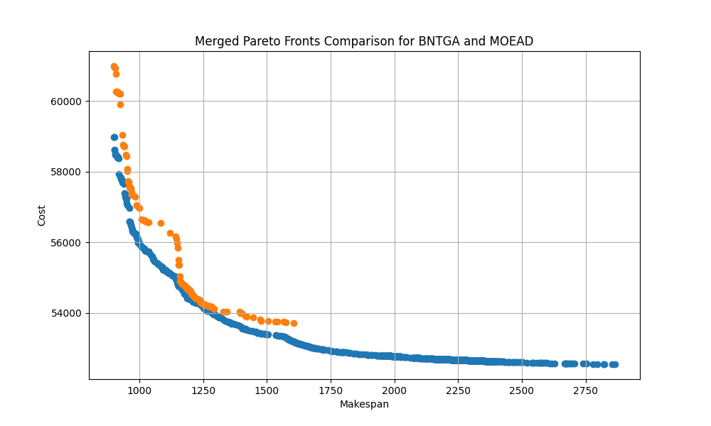

# Example of Use
This section provides instructions on how to use iMOPSE to compare two methods, BNTGA and MOEAD, on the MSRCPSP problem.

First, specify and optionally edit the method configuration file and other parameters as listed below:

**input parameters for BNTGA:**
- Method Configuration File: `../../configurations/methods/BNTGA/BNTGA_MSRCPSP.cfg`
- Problem Name: `MSRCPSP_TA2`
- Problem Instance File: `../../configurations/problems/MSRCPSP/Regular/200_20_150_9_D5.def`
- Output Directory: `../experiments/BNTGA/200_20_150_9_D5/`
- Number of Runs: `10`
- Seed: `0`

**input parameters for MOEAD:**
- Method Configuration File: `../../configurations/methods/MOEAD/MOEAD_MSRCPSP.cfg`
- Problem Name: `MSRCPSP_TA2`
- Problem Instance File: `../../configurations/problems/MSRCPSP/Regular/200_20_150_9_D5.def`
- Output Directory: `../experiments/MOEAD/200_20_150_9_D5/`
- Number of Runs: `10`
- Seed: `0`

Here, we use `BNTGA_MSRCPSP.cfg` and `MOEAD_MSRCPSP.cfg` configuration files for the methods, as well as `MSRCPSP_TA2` described previously. The instance is from the Regular set and is named `200_20_150_9_D5`. We also specify the output directory with the instance name, which will be helpful later during Pareto analysis. Additionally, we specify the repetition number.

Configuration Files:

**BNTGA Configuration File:**

MethodName BNTGA  
GenerationLimit 100  
Crossover UniformCX 0.6  
Mutation RandomBit 0.01  
PopulationSize 50  
GapSelection 40

**MOEAD Configuration File:**

MethodName MOEAD  
GenerationLimit 1000  
Crossover UniformCX 0.6  
Mutation RandomBit 0.01  
PartitionsNumber 50  
NeighbourhoodSize 10

During the optimization run for both methods, the optimizer outputs results to the specified directories, each containing Pareto Front Approximation from every run.

Now, we use Pareto Analyzer to calculate metrics and Python scripts for creating a visual comparison. For this, create a configuration file named `config.cfg`:

../../optimizer/experiments/BNTGA  
../../optimizer/experiments/MOEAD

Run the optimizer providing the following arguments:
- Configuration file: `../config.cfg`
- Instance name: `200_20_150_9_D5`
- Result directory: `../results/`

The analysis produces the following results:

| Metric        | BNTGA                       | MOEAD                        |
|---------------|-----------------------------|------------------------------|
| Runs          | 10                          | 10                           |
| TPFS          | 731                         | 107                          |
| MPFS          | 731                         | 107                          |
| MND           | 731                         | 0                            |
| HV            | 0.83860                     | 0.66322                      |
| HV Std        | 0.04535                     | 0.02192                      |
| GD            | 0.00177                     | 0.01216                      |
| GD Std        | 0.00317                     | 0.00283                      |
| IGD           | 0.00070                     | 0.01147                      |
| IGD Std       | 0.00102                     | 0.00137                      |
| PFS           | 435.20001                   | 64.10000                     |
| PFS Std       | 207.27750                   | 9.57549                      |
| ND            | 263.20001                   | 0.00000                      |
| ND Std        | 266.12546                   | 0.00000                      |
| ND/TPFS       | 0.36005                     | 0.00000                      |
| ND/TPFS Std   | 0.36406                     | 0.00000                      |

Based on the metrics provided, we can observe and compare the performance of BNTGA and MOEAD on the MSRCPSP problem.

Using the generated files, we can compare Pareto Front Approximations from each method.

On plot we can visually compare quality of each method result.